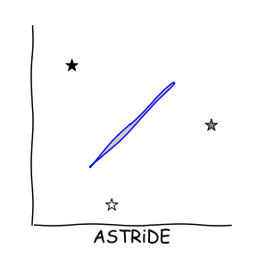
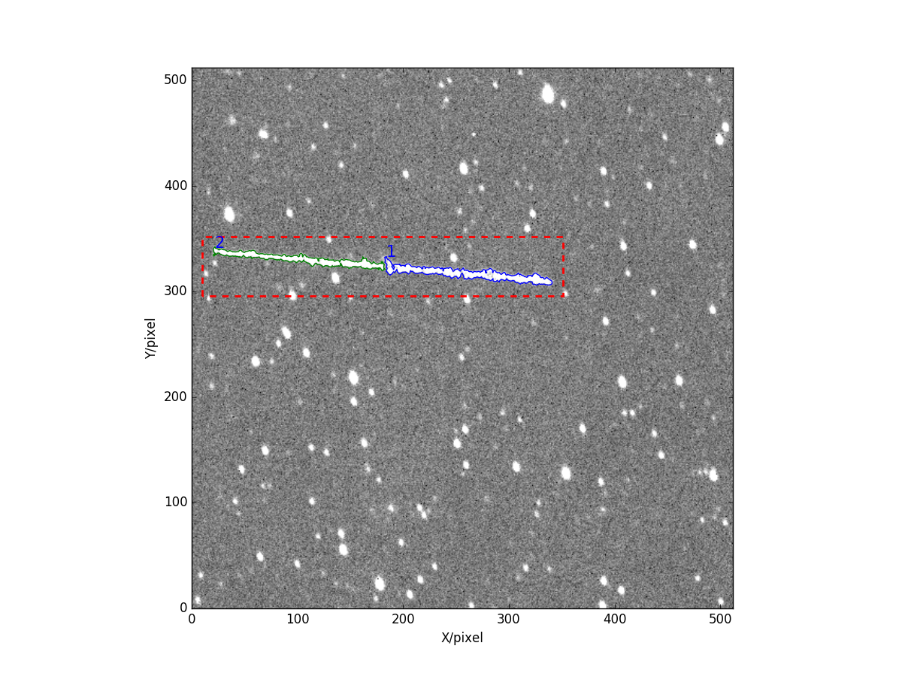
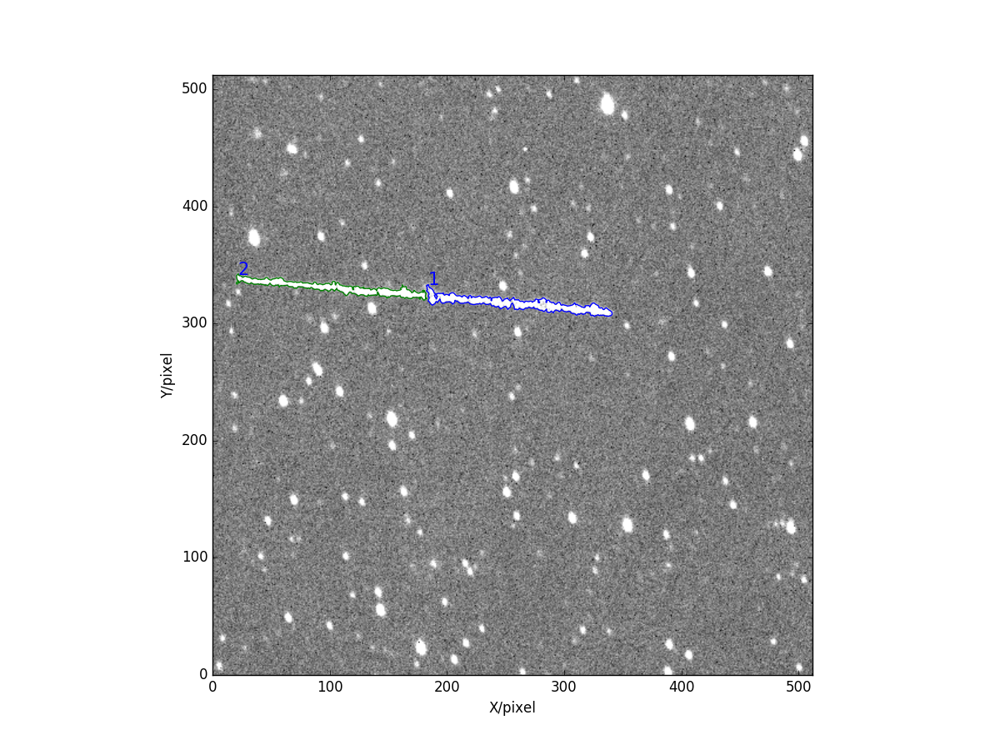
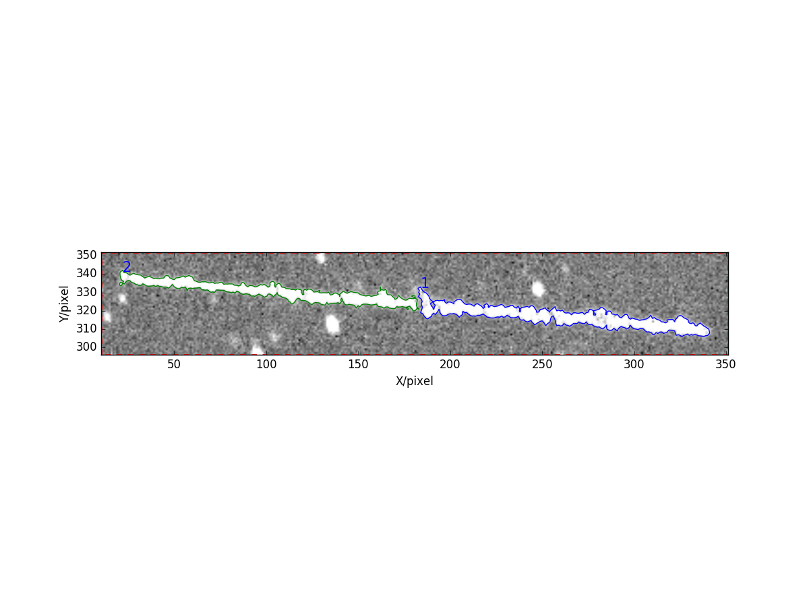
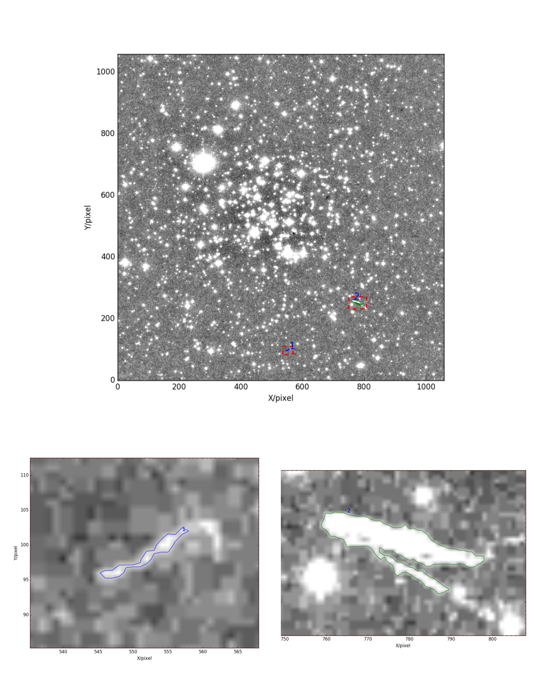
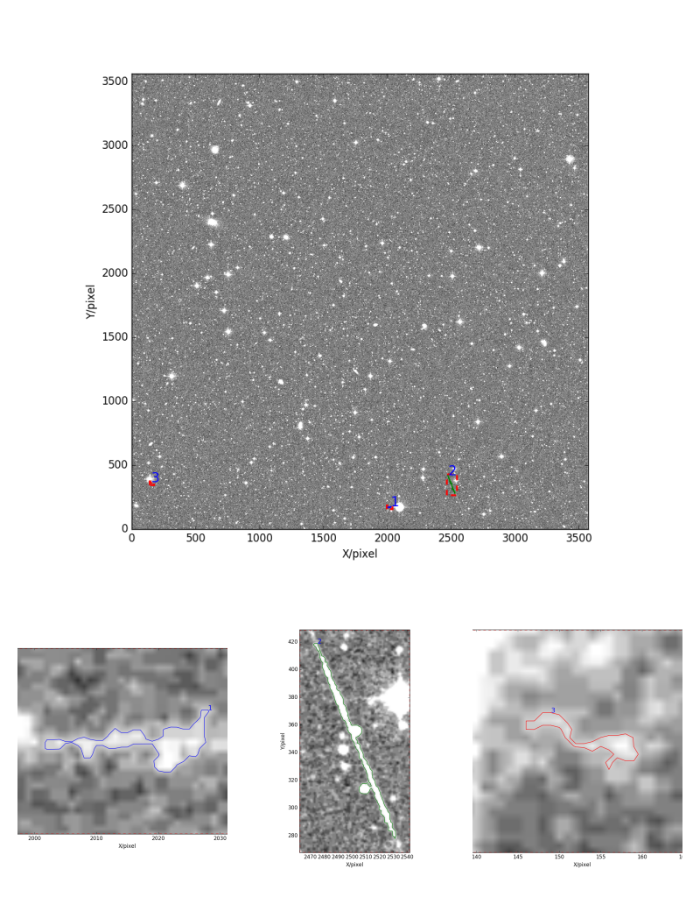
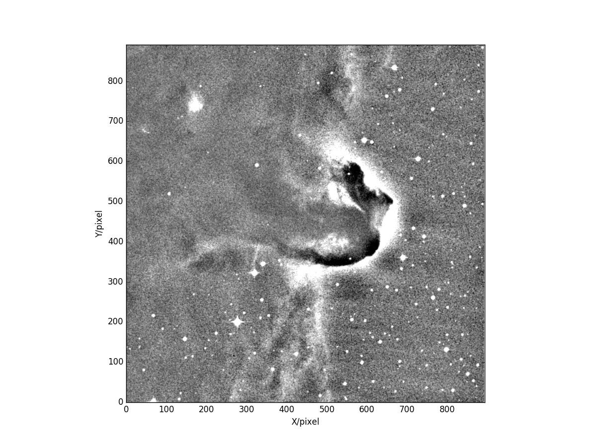
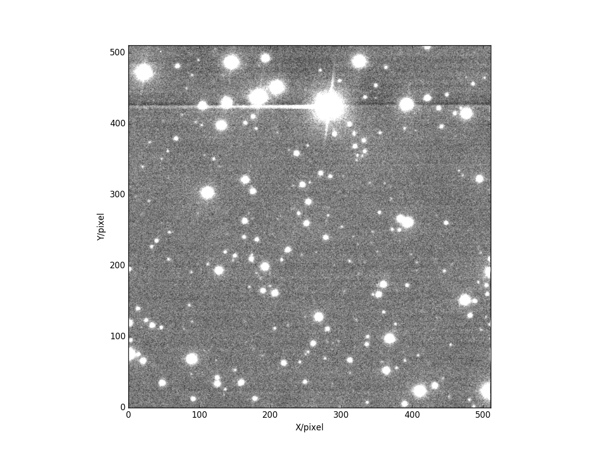
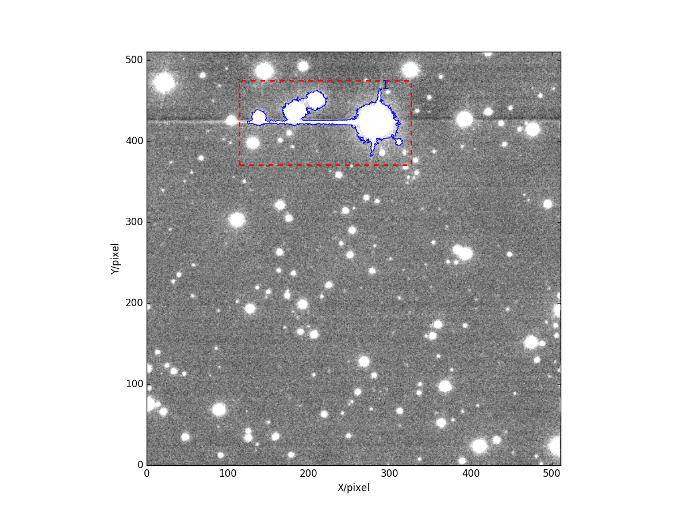
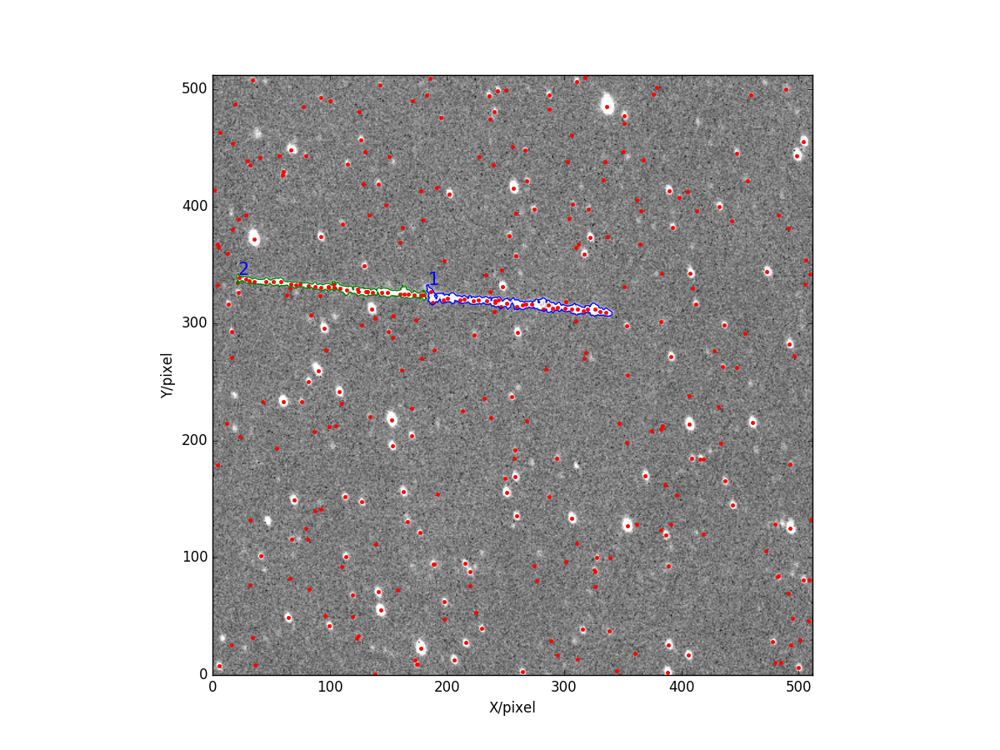

# ASTRiDE (Automated Streak Detection for Astronomical Images)

<div align="center">

</div>


<br/>
ASTRiDE aims to detect streaks in astronomical images using a "<b>border</b>" of each object (i.e. "[boundary-tracing](https://en.wikipedia.org/wiki/Boundary_tracing)" or "[contour-tracing](https://en.wikipedia.org/wiki/Boundary_tracing)") and their morphological parameters. Any kinds of fast moving objects such as [meteors](https://en.wikipedia.org/wiki/Meteoroid#Meteor), [satellites](https://en.wikipedia.org/wiki/Satellite), [near-Earth objects (NEOs)](https://en.wikipedia.org/wiki/Near-Earth_object), or even [cosmic rays](https://en.wikipedia.org/wiki/Cosmic_ray) could leave streak-like traces in the images. 

 
 The basic idea of ASTRiDE is from my previous work ([Kim+ 2005](http://adsabs.harvard.edu/abs/2005JASS...22..385K)), which also tried to detect streaks using a similar algorithm (i.e. boundary-tracing). Nevertheless, ASTRiDE uses an improved algorithm for quantifying the shape of each border to determine whether or not the border is a streak. ASTRiDE can detect not only long streaks but also relatively short or curved streaks whereas the original algorithm is less likely to detect such short or curved streaks.


## Index
1. [Dependency](#1-dependency)
2. [Installation](#2-installation)
3. [Test the Library](#3-test)
4. [How to Use ASTRiDE](#4-how-to-use-astride)
5. [Test with Crowded Field Image](#5-test-with-crowded-field-image)
6. [Application](#6-application-to-astronomical-images)

- [System Requirement](#system-requirement)
- [ChangeLog](#changelog)
- [Citation](#citation)
- [Contact](#contact)

## 1. Dependency

[Python 2.7+ and 3.5+](https://www.python.org/)

[Numpy 1.14+](http://www.numpy.org/)
 
 * Numerical Python library.

[Scipy 1.0.0+](https://www.scipy.org/)

 * Scientific Python library.

[Scikit-image 0.13.1+](http://scikit-image.org/)
 
 * To get a contour map of a fits image.

[Astropy 3.0+](http://www.astropy.org/)

 * For reading a fits file.

[Matplotlib 2.1.1+](http://matplotlib.org/)

 * For plotting figures.

[Phoutils 0.4+](http://photutils.readthedocs.org/en/latest/index.html)

 * For calculating background map of a fits image.


These libraries will be automatically installed if your machine does not have them installed. If you encounter errors during the installation of these dependencies, try to install them individually. Your machine may not have other required libraries by these dependencies.


## 2. Installation

The easiest way to install the ASTRiDE package is:

```python
pip install astride
```

Or,

```python
pip install git+https://github.com/dwkim78/ASTRiDE
```

If you do not want to install/upgrade the dependencies, execute the above commend with the ```--no-deps``` option. ASTRiDE possibly works with older version of Python and other libraries. 


Alternatively, you can download the ASTRiDE package from the Git repository as:

```python
git clone https://github.com/dwkim78/ASTRiDE

cd ASTRiDE
python setup.py install
```

You can edit ```setup.py```, if you do not want to update your own Python libraries (i.e. edit the ```install_requires``` variable).


## 3. Test

To check if ASTRiDE is correctly installed, type following commands in your Python console.

```python
from astride import test

test()
```

The command will print messages like:
```
yyyy-mm-dd hh:mm:ss,mmm INFO - Start.
yyyy-mm-dd hh:mm:ss,mmm INFO - Read a fits file..
yyyy-mm-dd hh:mm:ss,mmm INFO - Search streaks..
yyyy-mm-dd hh:mm:ss,mmm INFO - Save figures and write outputs to ./long/
yyyy-mm-dd hh:mm:ss,mmm INFO - Done.
```

The test module will save figures and information of detected streaks under the "./long/" folder. In the folder, you can find two images and one text file. The two images are:

| Image name | Description |
|----:|:------------|
| all.png |  The full image with detected streaks (shown below) |
| 1.png | A zoomed image for each linked streak |

<div align="center">

[ all.png ]</div>

<br/><br/>
The output text file named as "streaks.txt" contains following information.

| Column | Description |
|----:|:------------|
| ID  | Index |
| x_center, y_center  | Coordinate of the center  |
| area  | Area inside a streak  |
| perimeter  | Perimeter of a streak  |
| shape_factor  | 4 * PI * area / perimeter^2 |
| radius_deviation  | Parameter to check roundness  |
| slope  | Slope of a linear line fitted to a streak  |
| intercept  | Intercept of a linear line fitted to a streak  |
| connectivity  | ID of another streak that is likely to be linked to the current streak  |


These information are accessible using the ASTRiDE Streak instance. For details, see [this section](#accessible-information-inside-the-streak-instance).


## 4. How to Use ASTRiDE? 


### Pseudo Code

The following pseudo-code shows how to use ASTRiDE.

```python
# Import the ASTRiDE library.
from astride import Streak

# Read a fits image and create a Streak instance.
streak = Streak('YOUR_FITS_FILENAME.fits')

# Detect streaks.
streak.detect()

# Write outputs and plot figures.
streak.write_outputs()
streak.plot_figures()
```

Detailed explanation for these commands are given in the following sections.


### Create Streak Instance

We first need to import the ASTRiDE library and create a Streak instance as:

```python
from astride import Streak

streak = Streak('long.fits')
```

You can replace "long.fits" with your own fits filename. There are many options customizing the Streak instance such as:

| Options | Description |
|----:|:------------|
| remove_bkg | Choose a method to remove background of a fits image. Either 'constant' or 'map'. 'constant' calculates background statistics using the astropy sigma-clipped routine. 'map' derives a background map. 'map' is slow but relatively more accurate if the background is varying across the image field. Default is 'constant'. |
| bkg_box_size  | Box size for calculating a background map of a fits image. Default is 50. Only used when ```remove_bkg``` = 'map'. |
| contour_threshold  | Threshold to extract a contour map. If this value is high, only bright streaks will be detected. Default is 3. Higher values, faster ASTRiDE runtime. |
| min_points  | The minimum number of data points (i.e. pixels) of each border. Default is 10 (i.e. roughly saying, a length of ~5 pixels if the border is a streak-like object). Higher values, faster ASTRiDE runtime. |
| shape_cut  | Empirical cut for shape factor. Default is 0.2. |
| area_cut | Empirical cut for area inside each border. Default is 10. |
| radius_dev_cut  | Empirical cut for radius deviation. Default is 0.5. |
| connectivity_angle | The maximum angle of slope to link each streak. Default is 3 degree. |
| output_path  | Output path to save figures and outputs. Default is "None", which will create a folder of the input filename. |

Although you can customize pretty much everything of the Streak instance, it is recommended to leave them as they are until you understand each option. Some important options among these are explained through the following sections.

### Detect Streaks

Now we can detect streaks in the fits image as:

```python

streak.detect()
```

That's it! The above one-line command will do everything needed to detect streaks, which is:

  * Background removal
    * ASTRiDE first removes background from the fits image. By default, ASTRiDE calculate background level and its standard deviation using sigma-clipped statistics (i.e. ```remove_bkg='constant'```). If ```remove_bkg``` is 'map', the background map is derived using [Phoutils](http://photutils.readthedocs.org/en/latest/index.html). It calculates the map by sigma-clipping method within the box of the size "bkg_box_size". 
  
  * Contour map
    * Using the [scikit-image](http://scikit-image.org/), ASTRiDE derives the contour map of the fits image. The level of the contour is controlled by the "contour_threshold" value, such as: contour_threshold * background standard deviation (calculated when deriving the background map). Default "contour_threshold" is 3. The following images shows all the <b>borders</b> detected using the contour map.
    
    <div align="center">
    
    [ All the borders (color-coded) extracted using the contour map ]</div>
  
  <br/>
  * Streak determination based on the morphologies of each  border
    * As we can see from the above figure, there are many borders of star-like sources that are definitely <b>not</b> streaks. ASTRiDE removes such star-like sources using morphological parameters derived from each border such as:
    
| Morphology | Description |
|----:|:------------|
| Shape Factor | [Circularity](https://goo.gl/Z0Jy9z). The circularity of a circle is 1, and streak-like shape has much smaller circularity than 1. The default threshold is 0.2 (i.e. option "shape_cut") |
| Radius Deviation | An approximated deviation from roundness. Since the center of each border can be calculated, ASTRiDE calculates distances to each data point from the center. A radius is defined as the median value of the distances. ASTRiDE then calculates "roundness_deviation" as std(distances - radius) / radius. "std()" is the standard deviation. For a circle, the value is 0. The default threshold is 0.5 (i.e. option "radius_dev_cut"). |
| Area | The area inside a border must be larger than 10 pixels (i.e. option "area_cut"). |

The following figure shows the remaining two streak after these cut.
 
<div align="center">

[ Two streaks after the morphology cut. The numbers are their IDs. ]</div>
  
  <br/><br/>
  * Link streaks by their slopes
    * As shown in the above image, ASTRiDE finally detected two streaks. However, these two streaks are not really separated two streaks. They seem to be one streak, but separately detected since the middle part of the streak is disconnected. ASTRiDE connects (i.e. link) such streaks by their slopes derived using the linear line fitting. If their slopes are within the "connectivity_angle", and also the slope between the two centers of the two streaks are within the "connectivity_angle" with each streak, ASTRiDE determines that the two streaks are connected. This is why the "all.png" shown in the [section "Test"](#3-test) has only one red dashed-line box surrounding the two streaks. If one streak (i.e. s1) is determined to be linked with another streak (i.e. s2), s1's "connectivity" value is the index of s2. If s2 is again linked with s3, then again s2's "connectivity" is the index of s3. If s3 is not linked with any other streaks, s3's "connectivity" is -1.
     
     
Note that all the information derived during the above procedures are accessible using the Streak instance 
(See [this section](#accessible-information-inside-the-streak-instance)).

### Plot Figures and Write Outputs
    
ASTRiDE provides functions to write outputs and plot figures as:

```python
streak.write_outputs()

streak.plot_figures()
```

```streak.write_outputs()``` will write an output text file, "streaks.txt", which is explained in the [section "Test"](#3-test).


```streak.plot_figures()``` will generate figures including "all.png" (shown in [this section](#3-test)), and an individual figure for each linked streak. A filename of each individual file is the first index among the indices of the linked streaks such as "1.png" (shown below)

<div align="center">
</div>


### Accessible Information Inside the Streak Instance

The Streak instance - after calling "detect()" function - contains many information such as:

| Variable | Description |
|----:|:------------|
| streak.raw_image | Raw image before background removal |
| streak.background_map | Background map |
| streak.image | Background removed image |
| streak.raw_borders | All borders detected using a contour map |
| streak.streaks | The final list of streaks after excluding star-like sources and also after the linking (i.e. see Section [Detect Streaks](#detect-streaks)) |


Among these, ```streak.streaks``` contains a list of detected streaks. Each element has all the information that "streaks.txt" has (see [this section](#3-test)). It also contains additional information such as:

| Variable | Description |
|----:|:------------|
| x | X coordinates of a streak |
| y | Y coordinates of a streak |
| x_min and x_max | The minimum and maximum x coordinates of a streak |
| y_min and y_max | The minimum and maximum y coordinates of a streak |

Using the above information, you can plot your own figures.


### 5. Test with Crowded Field Image

The example shown above used a less-crowded field image. If there are many stars in the field (i.e. crowded field), it is possible that some stars' borders are attached to each other, which makes their borders long so that eventually look like a streak. In order to check how ASTRiDE works for such crowded field images, ASTRiDE is applied to a relatively crowded-field fits image. The following output images show the results.
 
 <div align="center">
<br/>
[ Streak detection test using the crowded field image ]</div>

These three images shown above are automatically generated by ASTRiDE. As you can see, ASTRiDE successfully excluded all the stars and detected two very short streaks (i.e. two bottom panels) that are quite hard to be detected even by eyes.


### 6. Application to Astronomical Images

The following images show the application of ASTRiDE. 

| [ESO DSS2](http://archive.eso.org/dss/dss) image | The Horsehead Nebular |
|---|---|
| <div align="center"> <br/>[ Three streaks are detected. ]</div> | <div align="center"> <br/>[ No streak is detected. ]</div> |


In the case of the ESO DSS2 image (left panel), ASTRiDE detected three streaks. However, only one streak (i.e. ID=2, bottom center panel) looks like a real streak. The following table shows some parameters derived by ASTRiDE.

| ID | Area | Perimeter | Shape Factor | Radius Deviation |
|---:|------|-----------|--------------|------------------|
|1   | 75.1 |   74.4    | 0.17         |  0.57            |
|2   | 640.3|   360.9   | 0.06         |  0.60            |
|3   | 21.6 |   38.8    | 0.18         |  0.52            |
  
As we can clearly see, the streak with ID=2 is longer than two others, and also has a smaller shape factor than others. All these variables are accessible using the Streak instance, so you can define your own criteria according to the shapes of streaks that you want to detect. For instance, if you are interested in relatively long streaks, you can use the values of "Perimeter". 


You can also set threshold cut for some of these parameters when creating the Streak instance. For details, see [this section](#create-streak-instance). For example, if you change the value of "shape_cut" to 0.3, ASTRiDE will also detect relatively <b>thicker</b> streaks. However, at the same time, it is also possible that ASTRiDE would return star-like objects.


In the case of the Horsehead Nebular image (right panel), it seems natural that ASTRiDE does not detect any streaks in the image.


The following example using the image of [M35 (NGC 2168)](http://astro.uchicago.edu/yerkes/outreach/activities/Explorations/MessierGallery/m35.html) gives an idea how to use the parameters mentioned above.

| Default Setting | Parameter Modified |
|---|---|
| <div align="center"> </div> | <div align="center"> </div> |

In the image, you can see the diffraction spike of the brightest stars, which is a sort of streaks. Left panel shows the result using the default ASTRiDE parameter setting, and it did not detect any streak. In the right panel, the two parameters were tuned (i.e. ```shape_cut = 0.3``` and ```radius_dev_cut = 0.4```), and ASTRiDE detected the spike. As you can clearly see, the spike shares its border with other stars, and it does not actually look like a streak anymore. That is the reason why it was not detected with the default setting. Nevertheless, as this example shows, you can decide your own criteria based on your needs.


### System Requirement
 
Any decent or even relatively old machines can run ASTRiDE as long as the machines are capable of running general Python libraries. Runtime for streak detection (i.e. wall-clock time) varies according to the size of fit images and the crowdedness of the images. In the cases of the examples shown in the previous sections, it took from 0.6 seconds to 25 seconds using Macbook Pro 13'' equipped with 2.7 GHz Intel Core i5, 8 GB memory, and 256 GB SSD. If you want to decrease ASTRiDE runtime, increase the values of ```contour_threshold``` and ```min_points``` when creating the Streak instance. For details, see [this section](#create-streak-instance). Changing those values, however, could result in non-detection of short or faint streaks.


### Note

As you might notice, ASTRiDE does not use any source detection algorithm (e.g. Source Extractor) to distinguish stars from streaks. This is because such algorithms often find star-like-sources <b>inside</b> a streak. For instance, see the following figure.

<div align="center">

[ Red circles are the sources detected by a source detection algorithm (i.e. DAOFIND-like algorithm) ]</div>

<br/><br/>
Thus such source detection algorithms are not suitable to distinguish streaks from stars. One might think using the detected sources to construct streaks by somehow connecting them. Such methods, however, might not be very efficient either for 1) short streaks, or 2) crowded field.


### Logger

If you want to write log messages either to console or to disk, you can use the ASTRiDE Logger class as:

```python
from astride import Logger

logger = Logger().getLogger()

logger.debug('debug message')
logger.info('info message')
logger.warn('warn message')
logger.error('error message')
logger.critical('critical message')
```

Keep in mind that you need to generate only one logger instance through the whole processes, but not many. If you want to save log messages to a file, generate a logger instance as follows:
 
 ```python
 logger = Logger('/PATH/TO/FILE.log').getLogger()
 ```

This will send log messages to both console and a log file. Note that the path must be the absolute path.

## ChangeLog

### v?.?.?
- real-time training of an outlier model to detect streaks?
    - Tested with several different clustering algorithms (e.g. Birch, KMeans, hierarchical clustering, etc.), and it works well for clear outliers but not for ambiguous outliers (of course not since, strictly speaking, they are not even outliers). In other words, it detects long and thin streaks easily since they are clear outliers (i.e. they are not point sources), but for short and rather thick streaks, it fails to detect. In contrast, the current method using morphological parameters detects both kinds.
    - Nevertheless, it is possible to use clustering methods as supplementary detection methods for long streaks.

### v0.3.5
- `fully_connected` parameter of `skimage.measure.find_contours` is exposed to Streak class.
- fixed a bug when calling phoutils daofild.

### v0.3.4
- all Python library dependencies are updated to the latest versions.
- default output_path in Streak class is modified to include the full path of the input filepath.
- x/y plot coordinate swapping bug fixed.

### v0.3.3
- phoutils library update to v0.4.

### v0.3.2
- tested under Python 3.5

### v0.3.1
- phoutils library update to v0.3.

### v0.3.0
- add an option to choose which method to use for the background removal (i.e. ```remove_bkg``` option). See [How to Use ASTRiDE](#4-how-to-use-astride) for details.

### v0.2.12
- modify class/function comments so that it is more legible

### v0.2.11
- remove unnecessary image files for PyPi distribution

### v0.2.1
- bug fixed and source code cleaned

### v0.2
- beta version released 

### v0.1
- initiate the GitHub repository

## Citation

If you use this package for science publication, a citation to the paper [Kim+ 2005](http://adsabs.harvard.edu/abs/2005JASS...22..385K) and also to the current [github repository](https://github.com/dwkim78/ASTRiDE) would be appreciated.

## Contact
Dae-Won Kim, email: dwkim78 at gmail.com

Webpage: https://sites.google.com/site/dwkim78/


#### Keywords

astronomy - fits image - streak - satellite - meteor - NEO - fast-moving objects - boundary-tracing - contour-tracing - morphology

